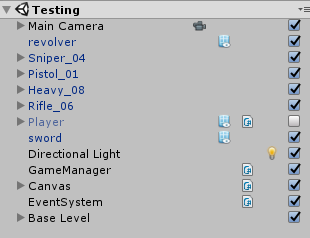
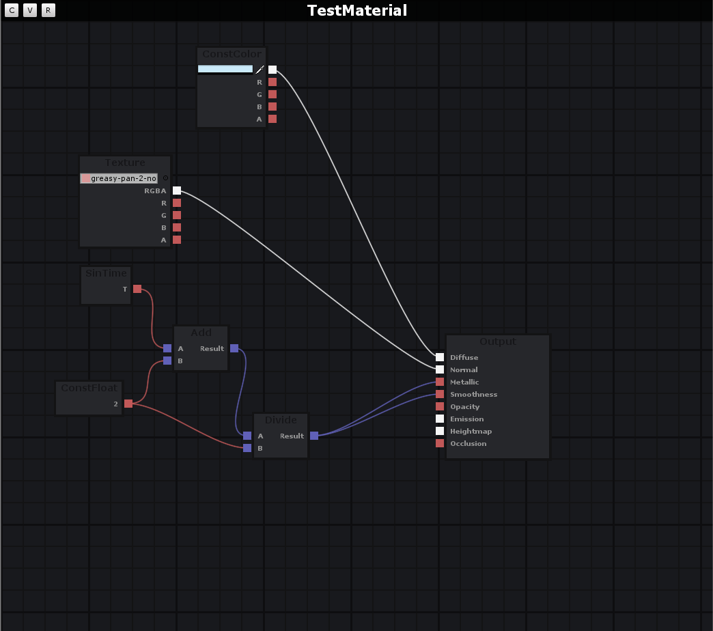

# BB_Extensions
Very simple Unity Editor extensions

# Extensions

### Better hierarchy

### Material Editor (WIP)

# What I want to do

- Better console
  - For now, colors should be fine I guess
- Node based post proccessing effects editor
  - Same like material editor with different output
- Better Inspector
  - I propably wont add it but who knows
  - Colors
  - Better prefabs managment
- Improve scene objects placements
  - Place on ground
  - ...